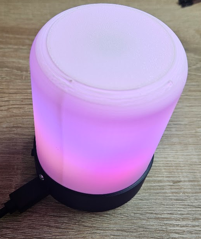

# Wifi RGB LED Lamp
This is the construction of Wifi controlled RGB LED lamp. It is based on ESP32-C3 super mini 
module and WS2812B LED strip and WLED project.

PCB is 2-layer and was designed using KiCad 10. Fabrication output for JLCPCB is in 
gerber folder.

**Happy soldering!**

